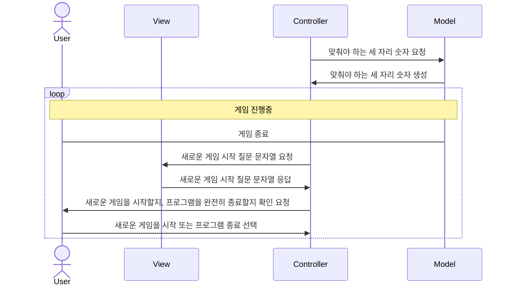
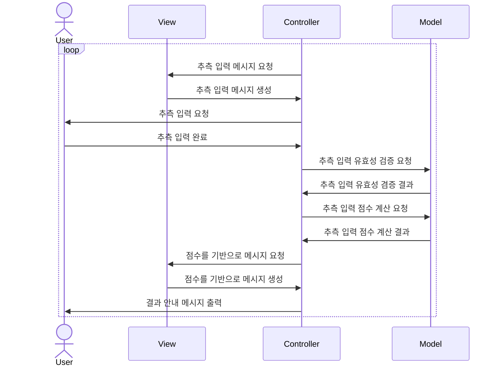

# 구현해야 하는 기능 정리

- 맞춰야 하는 세 자리 숫자 준비하기
- **(game start)** 사용자에게 추측할 세 자리 숫자를 요구하는 메시지 출력
- 사용자에게 세 자리 숫자 추측 입력 받기
    - 사용자 입력값이 1 ~ 9로 이루어진 세 자리 숫자가 아니면 IllegalArgumentException 발생시킨 후 프로그램 종료
- 사용자가 추측한 세 자리 숫자와 맞춰야 하는 숫자를 비교하기
- 비교 결과를 스트라이크, 볼, 낫싱 기준에 맞춰서 점수를 계산
- 이렇게 계산한 점수를 사용자에게 출력하기 위한 문자열로 변환
- 이때의 점수가
    - 3 스트라이크가 아니라면 **(game start)** 지점으로 돌아가서 반복
- 3 스트라이크가 맞다면 게임 종료 안내 메시지 출력 **(game finish)**
- 사용자에게 게임을 새로 시작할지, 종료할지 물어보는 메시지 출력
- 사용자의 게임 재시작 의사에 대한 입력 받기 (1: 새로 시작, 2: 프로그램 종료)
- 사용자가 새로 시작하기를 원하는 경우 **(game start)** 지점으로 돌아가서 반복
- 사용자가 프로그램 종료를 원하는 경우 exit

# 기능을 클래스/인터페이스로 분리

## RandomNumberGenerator

사용자가 맞춰야 하는 세 자리 숫자를 만들어낸다.<br />
이때 각 자리의 숫자는 각각 1 ~ 9 범위의 숫자여야 한다.<br />

## MessageDisplaying

상황에 맞는 메시지를 출력한다.

**GuessInputMessageDisplaying**: 세 자리 숫자을 추측해서 입력하도록 메시지를 출력한다.<br />
**GuessResultMessageDisplaying**: 추측 결과에 대해서 스트라이크, 볼, 낫싱으로 알려주는 메시지를 출력한다.<br />
**GameFinishedMessageDisplaying**: 추측이 성공했고, 방금 게임이 종료됐다고 알려주는 메시지를 출력한다.<br />
**GameRestartMessageDisplaying**: 새로운 게임을 시작할지, 프로그램을 완전히 종료할지 입력하도록 메시지를 출력한다.<br />

## InputAcceptor

사용자의 입력을 받아들인다.

**GuessInputAcceptor**: 추측하는 세 자리 숫자를 입력받는다.<br />
**GameRestartInputAcceptor**: 1을 입력받으면 새로운 게임을 시작하고, 2를 입력받으면 프로그램을 완전히 종료한다.<br />

## InputValidator

사용자의 입력의 validity 를 확인한다.

**GuessInputValidator**: 추측 입력 문자열은 길이가 3 이어야 하고 세 자리 모두 1 ~ 9 범위의 숫자여야만 한다.<br />
이외의 경우는 모두 IllegalArgumentException 예외를 던지고 프로그램을 종료한다.<br />
**GameRestartInputValidator**: 1, 2 이외의 입력값에 대해서는 IllegalArgumentException 예외를 던지로 프로그램을 종료한다.<br />

## ScoreBuilder

사용자의 추측과 맞춰야 하는 세 자리 숫자를 비교해서 점수를 계산한다.

```java
class Score {
    Integer strike;
    Integer ball;
}
```

## MessageBuilder

메시지로 출력할 문자열을 생성한다.

**ScoreMessageBuilder**: 계산한 스트라이크, 볼 개수를 기반으로 메시지를 만든다.<br />

# MVC 패턴 안에서 클래스/인터페이스 분류하기

## 프로그램 전체 플로우



## 게임 진행중 플로우



## Controller 영역에서 사용할 클래스/인터페이스

- InputAcceptor
    - GuessInputAcceptor
    - GameRestartInputAcceptor

## View 영역에서 사용할 클래스/인터페이스

- MessageDisplaying
    - GuessInputMessageDisplaying
    - GuessResultMessageDisplaying
    - GameFinishedMessageDisplaying
    - GameRestartMessageDisplaying
- MessageBuilder
    - ScoreMessageBuilder

## Model 영역에서 사용할 클래스/인터페이스

- RandomNumberGenerator
- InputValidator
    - GuessInputValidator
    - GameRestartInputValidator
- ScoreBuilder

-----

# 과제 안내 PDF 내용 정리

## 기능 요구사항

- 숫자 1 ~ 9 서로 다른 수로 이루어진 세 자리의 숫자를 맞추는 게임
- 추측을 위해서 제시한 숫자와 맞춰야 하는 숫자를 비교했을 떄
    - 스트라이크: 숫자가 일치하고 위치도 일치할 때 +1
    - 볼: 숫자가 일치하지만 위치가 다를 때 +1
    - 낫싱: 같은 숫자가 하나도 없을 때
- 맞춰야 할 숫자를 제시하는 쪽은 컴퓨터, 이 세 자리의 숫자를 맞추는 쪽은 사용자
- 사용자는 세 자리의 숫자를 맞출 때까지 계속해서 추측을 시도할 수 있다.
- 숫자를 추측하는데 성공하면 게임 종료
- 게임이 종료된 후 게임을 다시 시작하거나 완전히 종료할 수 있다.
- 사용자가 잘못된 값을 입력할 경우 IllegalArgumentException 을 발생시킨 후 애플리케이션은 종료되어야 한다.

## 실행 예시

```text
숫자를 입력해주세요: 123
1볼 1스트라이크
숫자를 입력해주세요: 145
1볼
숫자를 입력해주세요: 671
2볼
숫자를 입력해주세요: 216
1스트라이크
숫자를 입력해주세요: 713
3스트라이크
3개의 숫자를 모두 맞히셨습니다! 게임 종료
게임을 새로 시작하려면 1, 종료하려면 2를 입력하세요.
1
숫자를 입력해주세요: 123
1볼
...
```

## 요구사항 1 - 제약사항

- JDK 8 버전에서 실행가능해야 한다.
- src/text/java 폴더의 baseball.ApplicationTest 에 있는 2개의 Test Case 가 성공해야 한다.

## 요구사항 2 - 제약사항

- 자바 코드 컨벤션 지키기
- indent depth 는 최대 2까지만 가능
- Stream API 사용하지 않고 구현하기 (Lambda 는 사용 가능)
- else 를 사용하지 않는다.
- 모든 함수의 길이가 10라인을 넘어가지 않도록 구현한다.

## 요구사항 3 - 단위 테스트

- 도메인 로직에 단위 테스트 구현
- System.out, System.in, Scanner 로직은 단위 테스트 작성하지 않는다
- 핵심 로직을 구현하는 코드와 UI를 담당하는 로직을 분리해 구현한다.
- MVC 패턴 기반으로 구현한 후 View, Controller 를 제외한 Model 에 대한 단위 테스트를 추가하는 것에 집중한다.
- JUnit5, AssertJ 라이브러리 사용
